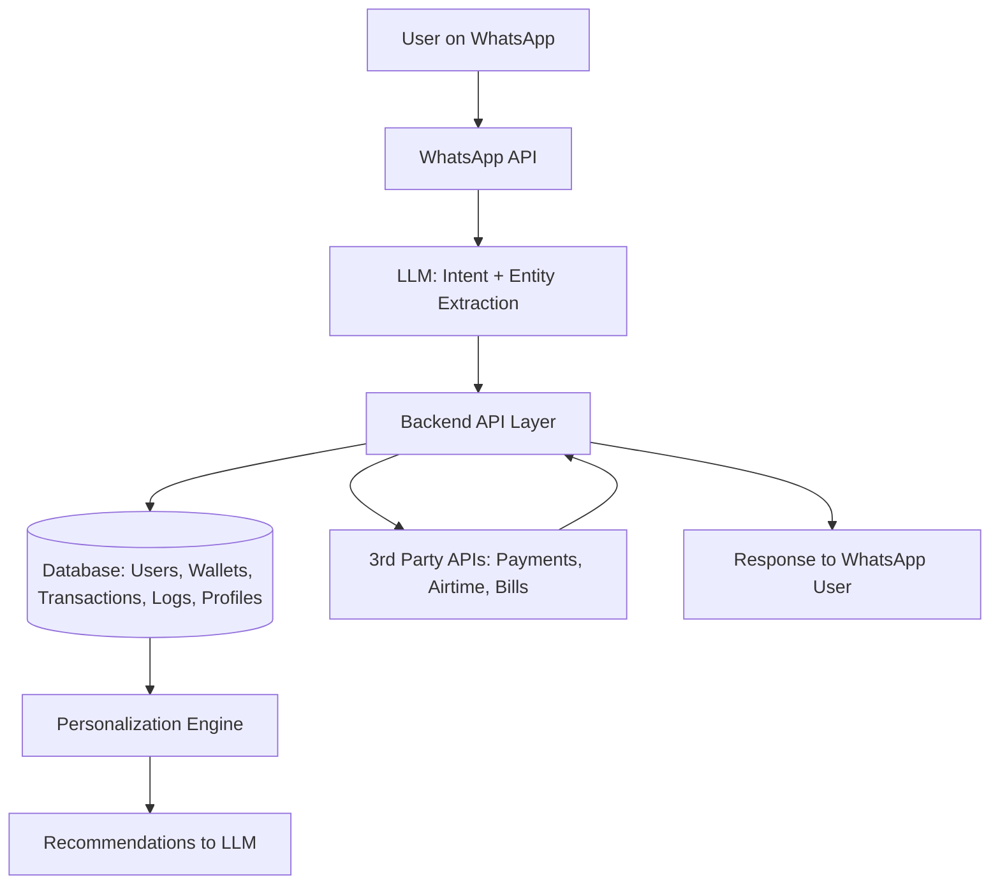

# Finclusion – Financial Inclusion Assistant

<div align="center">

<!-- Add your logos here -->


[](https://finclusion.site/)
[](LICENSE)
[](https://datafest.africa)

**Empowering Africa's Unbanked Through AI & WhatsApp**

[Website](https://finclusion.site/) • [Documentation](#-repositories) • [Demo](#) • [Team](#-team)

</div>

---

## Project Status


---

## About Us

We are a team of innovators participating in the **Datafest Africa 2025 Hackathon**, focused on solving one of Africa's most pressing challenges: **Financial Inclusion**.

Our mission is to design and prototype an **inclusive financial assistant** that empowers underserved individuals to access essential financial services seamlessly through **WhatsApp, AI, and data-driven personalization**.

---

## The Problem

Over **50% of Nigerian adults remain unbanked or underbanked**, facing barriers such as:

- Limited access to formal financial institutions
- Low digital literacy
- Language diversity (English, Pidgin, Yoruba, Hausa, etc.)
- Trust issues with digital platforms

This exclusion prevents millions from participating in the digital economy, saving effectively, or accessing credit.

---

## Our Solution – "Banking Iya Bolanle(Finclusion)"

We are building a **multilingual, multimodal financial assistant** that works directly inside **WhatsApp**, making it accessible to anyone with a phone and internet connection.

### Key Features

- **WhatsApp Chatbot** (Text, Voice, Image support)
- **AI-Powered Understanding** (English, Pidgin, Yoruba, Hausa)
- **Core Financial Services**: transfers, airtime/data purchase, bill payments, micro-savings
- **Bill Image Uploads** (OCR to extract payment details)
- **Voice-to-Action** (speak your transaction, the bot understands)
- **Personalization Layer** (recommends frequent actions, e.g., "Top up ₦500 MTN again?")
- **Financial Literacy Mode** (simple, contextual savings advice)
- **Secure with PIN Authentication** for transactions

---

## System Architecture



---

## Repositories

Our project is organized across three main repositories:

### [AI-ML-Infrastructure](https://github.com/Avengers-Deux/AI-ML-Infrastructure)
[](https://github.com/Avengers-Deux/AI-ML-Infrastructure)

The **brain of our system** - houses the AI agent and WhatsApp integration that powers intelligent conversations, intent recognition, and multimodal interactions.

**Key Components:**
- WhatsApp Business API integration
- LLM-powered intent extraction and entity recognition
- Multilingual NLP (English, Pidgin, Yoruba, Hausa)
- Voice and image processing pipelines
- Personalization recommendation engine

---

### [DE-Infrastructure](https://github.com/Avengers-Deux/DE-Infrastructure)
[](https://github.com/Avengers-Deux/DE-Infrastructure)

The **data foundation** - contains the website codebase and comprehensive database design documentation deployed on DBIO.

**Key Components:**
- Database schema and architecture documentation
- Data pipeline configurations
- ETL processes for user analytics
- Marketing website codebase
- Database deployment on DBIO

---

### [Finclusion API](https://github.com/Avengers-Deux/finclusion-api)
[](https://github.com/Avengers-Deux/finclusion-api)

The **web application layer** - provides the web version of our financial assistant with full-featured dashboard and transaction management.

**Key Components:**
- RESTful API backend
- User authentication and authorization
- Wallet and transaction management
- Integration with payment gateways
- Bill payment and airtime services
- Web dashboard UI

---

## Tech Stack

### Frontend & Web


### Backend & AI


### Database & Infrastructure


### Integrations


---

## Team

We are a multidisciplinary team of **software engineers, AI developers, data analysts, and data engineers**, united by a passion for solving real African problems with technology.

### Our Expertise
- Full-Stack Development
- AI/Machine Learning
- Data Engineering & Analytics


---

## Getting Started

### Prerequisites
- Node.js v18+
- Python 3.9+
- PostgreSQL 14+
- WhatsApp Business API access

### Quick Start

1. **Clone the repositories:**
```bash
# AI/ML Infrastructure
git clone https://github.com/Avengers-Deux/AI-ML-Infrastructure.git

# Data Engineering Infrastructure
git clone https://github.com/Avengers-Deux/DE-Infrastructure.git

# API & Web Application
git clone https://github.com/Avengers-Deux/finclusion-api.git
```

2. **Visit our website:**
   - Production: [https://finclusion.site/](https://finclusion.site/)

3. **Read the documentation:**
   - Each repository contains detailed setup instructions in their respective READMEs

---

## Demo

> **Coming Soon** - Watch our solution in action!

---

## Contributing

We welcome contributions! Please see the individual repository contributing guidelines:
- [AI-ML Contributing Guide](https://github.com/Avengers-Deux/AI-ML-Infrastructure/blob/main/CONTRIBUTING.md)
- [DE Contributing Guide](https://github.com/Avengers-Deux/DE-Infrastructure/blob/main/CONTRIBUTING.md)
- [API Contributing Guide](https://github.com/Avengers-Deux/finclusion-api/blob/main/CONTRIBUTING.md)

---

## License

This project is licensed under the MIT License - see the [LICENSE](LICENSE) file for details.

---

## Contact

- 🌐 Website: [finclusion.site](https://finclusion.site/)
- 📧 Email: team@finclusion.site
- 🐦 Twitter: [@finclusion](#)

---

## Acknowledgments

- **Datafest Africa 2025** for the opportunity to showcase our solution
- Our users and testers for invaluable feedback
- The open-source community for amazing tools and libraries

---

<div align="center">

**Made with ❤️ for Africa's Financial Future**

Star our repositories if you find this project interesting!

</div>
