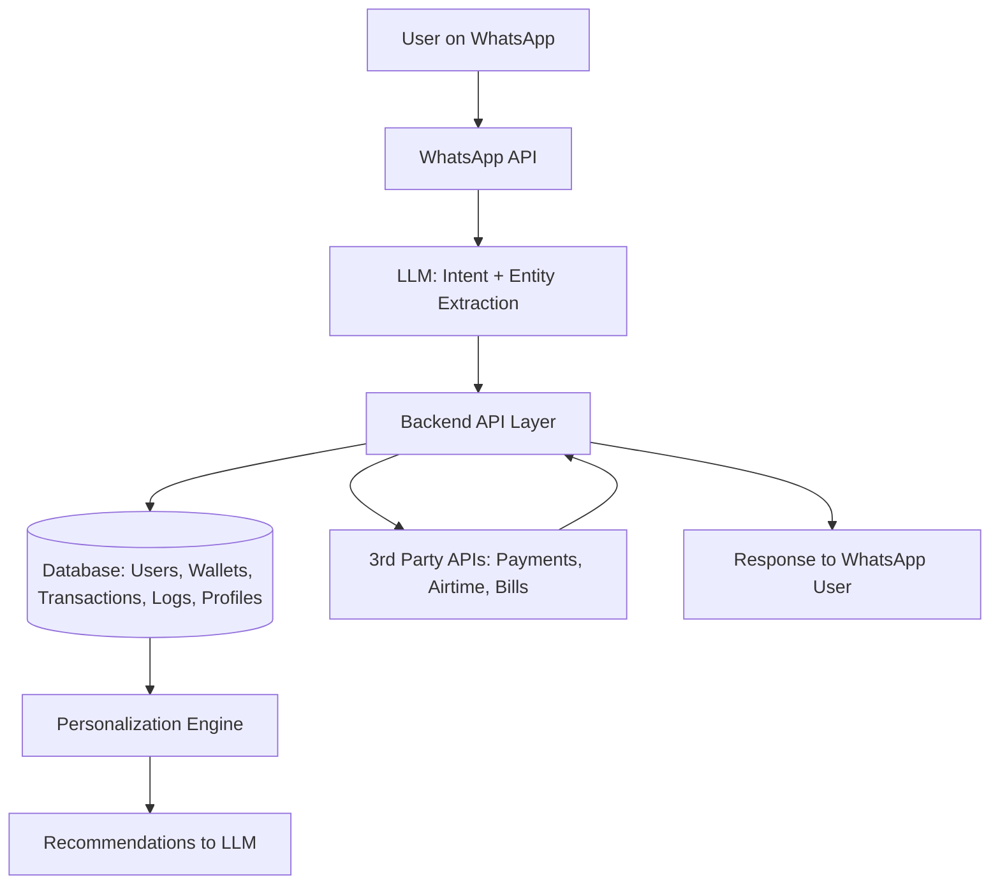

# Hack4Africa – Financial Inclusion Assistant  

## About Us  
We are a team of innovators participating in the **Datafest Africa 2025 Hackathon**, focused on solving one of Africa’s most pressing challenges: **Financial Inclusion**.  

Our mission is to design and prototype an **inclusive financial assistant** that empowers underserved individuals to access essential financial services seamlessly through **WhatsApp, AI, and data-driven personalization**.  

---

## The Problem  
Over **50% of Nigerian adults remain unbanked or underbanked**, facing barriers such as:  
- Limited access to formal financial institutions.  
- Low digital literacy.  
- Language diversity (English, Pidgin, Yoruba, Hausa, etc.).  
- Trust issues with digital platforms.  

This exclusion prevents millions from participating in the digital economy, saving effectively, or accessing credit.  

---

## Our Solution – “Banking Iya Bolanle”  
We are building a **multilingual, multimodal financial assistant** that works directly inside **WhatsApp**, making it accessible to anyone with a phone and internet connection.  

### Key Features  
- **WhatsApp Chatbot** (Text, Voice, Image support).  
- **AI-Powered Understanding** (English, Pidgin, Yoruba, Hausa).  
- **Core Financial Services**: transfers, airtime/data purchase, bill payments, micro-savings.  
- **Bill Image Uploads** (OCR to extract payment details).  
- **Voice-to-Action** (speak your transaction, the bot understands).  
- **Personalization Layer** (recommends frequent actions, e.g., “Top up ₦500 MTN again?”).  
- **Financial Literacy Mode** (simple, contextual savings advice).  
- **Secure with PIN Authentication** for transactions.  

---

## 🏗️ System Architecture  

## Team

We are a multidisciplinary team of software engineer, AI developer, data analyst and data engineers, united by a passion for solving real African problems with technology.

